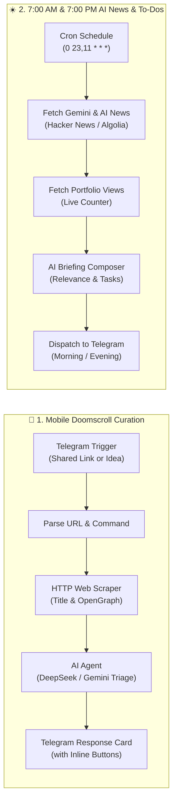

# 🤖 n8n Workflow Guide: Telegram Curation Queue & 7AM/7PM AI News

This guide explains how to import and run your **Telegram Mobile-to-Desktop Antigravity Curation & 7AM/7PM Gemini AI News Workflow** inside **n8n**.

---

## 🚀 Quick Import into n8n

1. Open your **n8n dashboard** (e.g. `http://localhost:5678` or your hosted n8n).
2. Click **Add Workflow** -> Click the **three dots menu (⋮)** on the top right.
3. Select **Import from File** (or **Import from URL / Clipboard**).
4. Choose [`notes/n8n-telegram-antigravity-curation.json`](file:///C:/Users/Emman/OneDrive/Desktop/You/AI/notes/n8n-telegram-antigravity-curation.json) or [`personal-assistant-bot/n8n/telegram-antigravity-curation-workflow.json`](file:///C:/Users/Emman/OneDrive/Desktop/You/AI/personal-assistant-bot/n8n/telegram-antigravity-curation-workflow.json).
5. All 12 nodes, triggers, routing rules, and AI connections will populate automatically!

---

## 🔑 Credentials & Environment Setup in n8n

| Credential | In n8n | What to set |
|---|---|---|
| **Telegram Bot API** | `Telegram Trigger` & `Telegram Send` | Your Bot Token from [@BotFather](https://t.me/BotFather) |
| **DeepSeek API Key** | `OpenAI / LangChain Model` | Base URL: `https://api.deepseek.com`, Model: `deepseek-chat`, API Key: `sk-...` |
| **Google Gemini API** (Alternative) | `Google PaLM / Gemini Model` | Google AI Studio API Key |
| **GitHub Personal Access Token** | `GitHub / Obsidian Vault Commits` | `VAULT_PAT` (contents read/write on `emmanalcazarjr-ops/obsidian-vault`) |

---

## 🔄 Dual Pipeline Overview

---

## ⏰ Notification Schedule Details (Asia/Manila UTC+8)

- **7:00 AM Morning Briefing** (`23:00 UTC`):
  - Weather in Manila + temperature & conditions.
  - Top Gemini & DeepMind AI breakthroughs affecting developer workflows.
  - Today's prioritized To-Dos & Antigravity queue items.
  - Portfolio live view stats & high-energy start.
- **7:00 PM Evening Wrap-Up** (`11:00 UTC`):
  - Evening AI pulse & practical takeaways.
  - Review of completed items vs pending queue tasks for tomorrow's Antigravity session.
  - Portfolio stats & relaxing sign-off.
